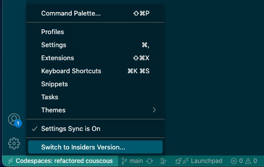

# **About Up the Demo**

- **About the App:** This is a modern TypeScript web-app with separate API and Frontend (React) projects that you will enhance with Copilot Agent Mode, Vision, MCP Servers and GHAS/Actions.
- **Why:** Demonstrate how Copilot can analyze and enhance existing code automatically, understand images, vulnerabilities and testing and how you can extend Copilot's capabilities with MCP server.
- **Demos**: You don't have to do all these demos, or do them in order. Get comfortable with the scenarios and practice them and then mix/match according to your audience.
- **MCP Servers**: The GitHub MCP server runs via Docker. You will need to install Docker locally to run it (it should work fine in a Codespace automatically). I use Podman for my Mac. Install this _before_ you attempt this demo! You'll also need a PAT that has enough permissions for your demos. Details below.
- **Padawan**: If you want to use Padawan, you have to ensure that it is enabled on the repo, that Actions are enabled and that you have a branch protection rule for `main`. I recommend creating a PR required for changes to Default branch with 1 required reviewer.
- **Local vs Codespaces:**  
  - This demo can work in a Codespace - but some scenarios (like running Playwright tests) require that you work in a local VSCode (clone the repo locally)
  - The visibility of the API port (3000) must be set to `public`. I have set this in the port attributes of the devcontainer file, but it seems that this config setting isn't always obeyed. Check before the demo! If you forget this, you will see CORS errors when the frontend tries to reach the API.
  - Make sure you **PRACTICE** this demo _before_ trying it in front of customers
  - Remember, Copilot is non-deterministic so you can't always predict exact behavior. Make sure you are comfortable with this environment so you can pivot quicky!
  - You don't have to use **VS Code Insiders** Version unless you want to demo features that you know are in preview.
    - If you want to access the Insiders Version in the web-version of a Codespace, click on the gear-icon on the bottom-left and select `Switch to Insiders Version...`

  

## **Building, Running and Debugging the code**

Refer to [the build docs](../../docs/build.md).
